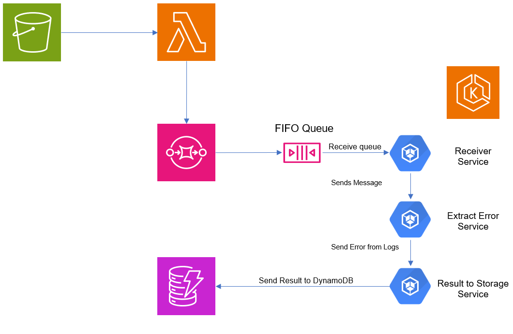

# microservice_log_analysis

### I added a cool animation to show how the flow of the UML goes. Enter this in the browser --> https://omerrevach.github.io/microservice_log_analysis-/

## Project Summary:

   - User uploads a log file via a web app.
   - The file is stored in S3.
   - An SQS FIFO Queue triggers a Python service in EKS.
   - The Python service analyzes the log file for errors.
   - Results are stored in DynamoDB.
   - The user receives an email notification with a summary of the results.

### Key Components: EKS, SQS (FIFO), S3, DynamoDB, SES, Python.

S3 Event Trigger → Lambda → SQS → Backend
Flow Explanation:

    User Uploads a File to S3.
    S3 Event Notification triggers SQS automatically.
    Python Log Processor receives the message from SQS.
    ✅ S3 Automatically Includes File Metadata in the Event Message.
    The Processor extracts error data from the message itself instead of downloading the whole file.
